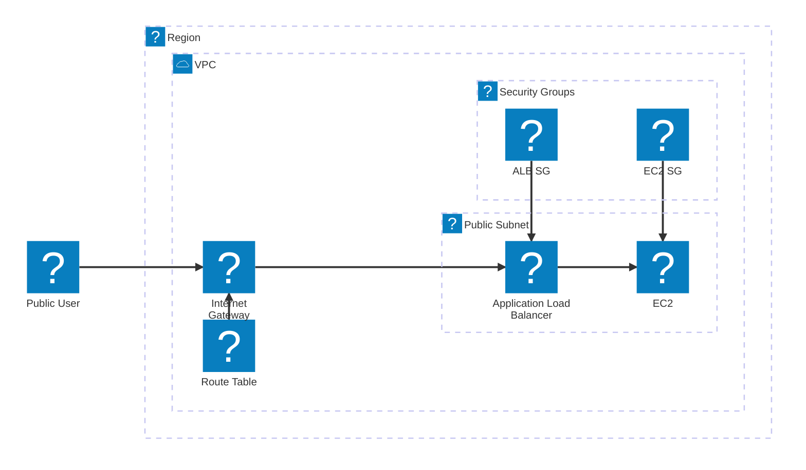

# Deploying code as zip file to a VM

```mermaid
architecture-beta
    group region(fa:globe)[Region]
        group vpc(cloud)[VPC] in region
            service rt(logos:aws-vpc)[Route Table] in vpc
            group subnet(fa:network)[Public Subnet] in vpc    
                service alb(logos:aws-elb)[Application Load Balancer] in subnet
                service ec2(logos:aws-ec2)[EC2] in subnet
            group sg_group(fa:lock)[Security Groups] in vpc
                service alb_sg(logos:aws-ec2)[ALB SG] in sg_group
                service ec2_sg(logos:aws-ec2)[EC2 SG] in sg_group
        service igw(logos:aws-vpc)[Internet Gateway] in region
    service user(fa:user)[Public User]

    %% Connections
    user:R --> L:igw
    igw:R --> L:alb
    alb_sg:B --> T:alb
    alb:R --> L:ec2
    ec2_sg:B --> T:ec2
    rt:T --> B:igw
```
