# EKS Notes
$\color{Orangered}{\textsf{EKS costs \$0.10 per hour}}$
## EKS Auto Mode

igw -->
vpc -->
public subnet in az -->
private subnet in az -->
cluster IAM role (AmazonEKSComputePolicy, AmazonEKSBlockStoragePolicy, AmazonEKSLoadBalancingPolicy, AmazonEKSNetworkingPolicy, AmazonEKSClusterPolicy) -->
Node IAM role (AmazonEKSWorkerNodeMinimalPolicy, AmazonEC2ContainerRegistryPullOnly) -->
Access policy (AmazonEKSViewPolicy??? - to operate kubectl locally)

```mermaid
architecture-beta
    group cloud(cloud)[Cloud]
        service igw(logos:aws-igw)[Internet Gateway]
    group vpc(cloud)[VPC] in cloud
        group pub_subnet(cloud)[Public Subnet] in cloud
        group priv_subnet(cloud)[Private Subnet] in cloud
```



### Notes

1. Create resources for your CLI user to manage a cluster with kubectl locally:
    * `aws_eks_access_entry` 
    * `aws_eks_access_policy_association`:
       * with `arn:aws:eks::aws:cluster-access-policy/AmazonEKSViewPolicy` for readOnly
       * with `arn:aws:eks::aws:cluster-access-policy/AmazonEKSClusterAdminPolicy` for management

2. Update config context:

    ```bash
    aws eks update-kubeconfig --name "sandbox"
    ```

3. Check access:

   ```bash
    kubectl get nodegroups
   ```

4. (!) Provisioned node groups won't delete if `aws_eks_node_group.scaling_config.min_size` > 0.


## EKS standard (manual configuration)

igw -->
vpc -->
public subnet -->
private subnet/s -->
cluster -->
namespace -->
node groups -->
auto-scaling
