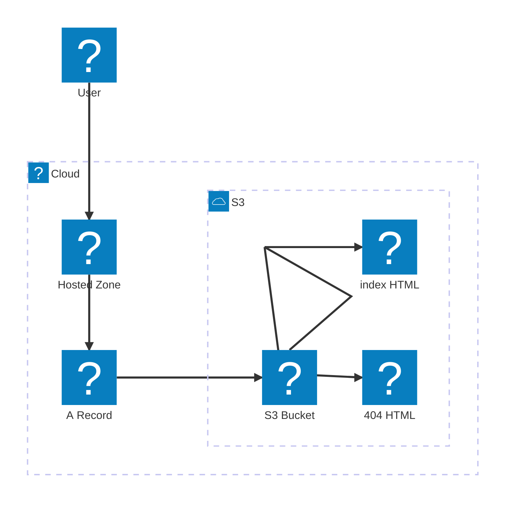

# A simple example of a static site provisioning

```mermaid
architecture-beta
    group aws(logos:aws)[Cloud]
        service hosted_zone(logos:aws-route53)[Hosted Zone] in aws
        service a_record(logos:aws-route53)[A Record] in aws

    group s3(cloud)[S3] in aws
        service bucket(logos:aws-s3)[S3 Bucket] in s3
        service index_obj(fa-file)[index HTML] in s3
        service error_obj(fa-file)[404 HTML] in s3
        junction center in s3

    service user(fa-user)[User]

    user:B        --> T:hosted_zone
    hosted_zone:B --> T:a_record
    a_record:R    --> L:bucket
    bucket:T      --  L:center 
    center:R      --> L:index_obj
    center:B      --> L:error_obj
```
