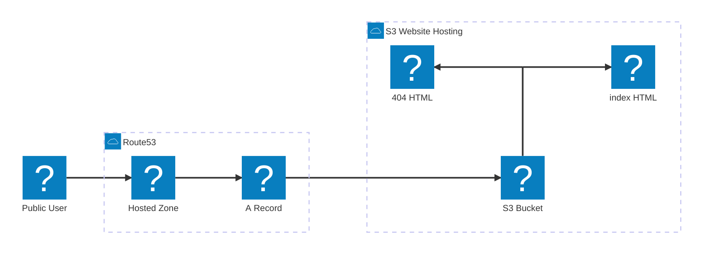

# A simple example of a static site provisioning

```mermaid
architecture-beta
    group route53(cloud)[Route53]
        service hosted_zone(logos:aws-route53)[Hosted Zone] in route53
        service a_record(logos:aws-route53)[A Record] in route53

    group s3(cloud)[S3 Website Hosting]
        service bucket(logos:aws-s3)[S3 Bucket] in s3
        service index_obj(fa-file)[index HTML] in s3
        service error_obj(fa-file)[404 HTML] in s3
        junction center in s3

    service user(fa-user)[Public User]

    user:R --> L:hosted_zone
    hosted_zone:R --> L:a_record
    a_record:R --> L:bucket
    bucket:T -- B:center 
    center:R --> L:index_obj
    center:L --> R:error_obj
```